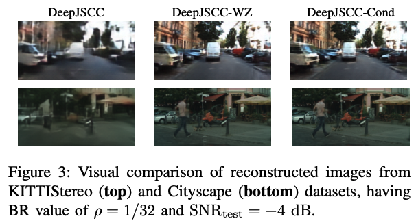
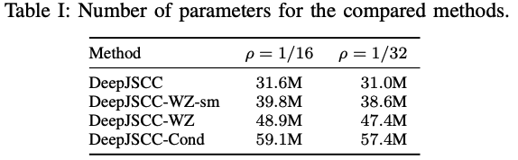
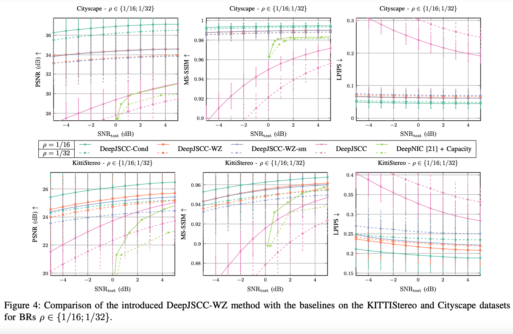

# Distributed Deep Joint Source-Channel Coding with Decoder-Only Side Information (ICMLCN 2024) \[[Paper](https://arxiv.org/abs/2310.04311)\]
This repository contains the implementation of the paper "Distributed Deep Joint Source-Channel Coding with Decoder-Only Side Information".


## Table of Contents
- [Distributed Deep Joint Source-Channel Coding with Decoder-Only Side Information (ICMLCN 2024) \[Paper\]](#distributed-deep-joint-source-channel-coding-with-decoder-only-side-information-icmlcn-2024-paper)
  - [Table of Contents](#table-of-contents)
  - [Citation](#citation)
  - [Abstract](#abstract)
  - [Installation](#installation)
  - [Training a Single Model on a Single Dataset and Bandwidth Ratio](#training-a-single-model-on-a-single-dataset-and-bandwidth-ratio)
  - [Reproducing All the Experiments on the Paper](#reproducing-all-the-experiments-on-the-paper)
  - [Evaluation](#evaluation)
  - [Checkpoints](#checkpoints)
  - [Results](#results)
  - [Notes](#notes)


## Citation
Please cite the paper if this code or paper has been useful to you:

```
@misc{yilmaz2023distributed,
      title={Distributed Deep Joint Source-Channel Coding with Decoder-Only Side Information}, 
      author={Selim F. Yilmaz and Ezgi Ozyilkan and Deniz Gündüz and Elza Erkip},
      year={2023},
      eprint={2310.04311},
      archivePrefix={arXiv},
      primaryClass={cs.CV},
      url = {https://arxiv.org/abs/2310.04311},
      howpublished = {to appear in \emph{2024 IEEE International Conference on Machine Learning for Communication and Networking}}
}
```

## Abstract
We consider low-latency image transmission over a noisy wireless channel when correlated side information is present only at the receiver side (the Wyner-Ziv scenario). In particular, we are interested in developing practical schemes using a data-driven joint source-channel coding approach, which has been previously shown to outperform conventional separation-based approaches in the practical finite blocklength regimes, and to provide graceful degradation with channel quality. We propose a novel neural network architecture that incorporates the decoder-only side information at multiple stages at the receiver side. Our results demonstrate that the proposed method succeeds in integrating the side information, yielding improved performance at all channel conditions in terms of the various quality measures considered here, especially at low channel signal-to-noise ratios and small bandwidth ratios. We have made the source code of the proposed method public to enable further research, and the reproducibility of the results.

## Installation
To install environment, run the following commands after installing `Python 3.10` or above, and `torch>=1.10.0` for your specific training device ([Pytorch Installation](https://pytorch.org/get-started)):

```
git clone https://github.com/ipc-lab/deepjscc-wz.git
cd deepjscc-wz
pip install -r requirements.txt
```

Then, place the KittiStereo and Cityscape datasets in the `data` folder. The datasets can be downloaded from the following links:
* Cityscape
  * Download the image pairs from [here](https://www.cityscapes-dataset.com/downloads/). After downloading `leftImg8bit_trainvaltest.zip` and `rightImg8bit_trainvaltest.zip` to the `data` folder, run the following commands:
  ```bash
  mkdir cityscape_dataset
  unzip leftImg8bit_trainvaltest.zip
  mv leftImg8bit cityscape_dataset
  unzip rightImg8bit_trainvaltest.zip
  mv rightImg8bit cityscape_dataset
  ```
  * Folder structure needs to be as follows: `data/cityscape_dataset/leftImg8bit/val` and `data/cityscape_dataset/leftImg8bit/train` (for training) and `data/cityscape_dataset/leftImg8bit/test` (for testing). Subfolders are named as city names such as berlin and munich, containing images.
* KittiStereo
  * Download the necessary image pairs from [KITTI 2012](http://www.cvlibs.net/download.php?file=data_stereo_flow_multiview.zip) and [KITTI 2015](http://www.cvlibs.net/download.php?file=data_scene_flow_multiview.zip). After obtaining `data_stereo_flow_multiview.zip` and `data_scene_flow_multiview.zip` in the `data` folder, run the following commands:
  ```bash
  unzip data_stereo_flow_multiview.zip # KITTI 2012
  mkdir data_stereo_flow_multiview
  mv training data_stereo_flow_multiview
  mv testing data_stereo_flow_multiview

  unzip data_scene_flow_multiview.zip # KITTI 2015
  mkdir data_scene_flow_multiview
  mv training data_scene_flow_multiview
  mv testing data_scene_flow_multiview
  ```
  * Folder structure needs to be as follows: `data/data_scene_flow_multiview/training`, `data/data_scene_flow_multiview/testing` and `data/data_stereo_flow_multiview/training`, `data/data_stereo_flow_multiview/testing` (for training, validation and testing), where subfolders are named like `image_2` and `image_3`. Text files containing paths are already in this repository (`data/KITTI_stereo_train.txt`, `data/KITTI_stereo_val.txt`, `data/KITTI_stereo_test.txt`).

## Training a Single Model on a Single Dataset and Bandwidth Ratio
To train a single model on a single dataset and bandwidth ratio, the following command can be used:

```
cd src
python train.py trainer.devices=[0] model=base_deepjscc model.N=256 model.snr=undefined model.csi.min=-5.0 model.csi.max=5.0 model/loss=mse_lpips model.loss.lpips_weight=0.001 data.name=<data_name> model._target_=<model_class> model.bw_factor=<bw_factor>
```

Description of the parameters used are as follows:
* `trainer.devices`: The device to be used for training. Here, `trainer.devices=[0]` indicates the GPU device (e.g. 0th gpu) to be used for training.
* `model`: The name of the model to be used for training. Here, `model=base_deepjscc` indicates that the base DeepJSCC class is to be used for training. The config is brought from the `config/model/base_deepjscc.yaml` file.
* `model.N`: Number of convolutional filters in middle layers of encoder and decoder (default=256).
* `model.snr`: This is disregarded since we state min and max csi, but required for the code to run. Just use `undefined` as the value.
* `model.csi.min` and `model.csi.max`: Minimum and maximum values of the channel signal-to-noise ratio (csi) to be used for training. During training, the csi value will be sampled uniformly from the interval `[min, max]`.
* `model/loss`: The loss function to be used for training. Here, `model/loss=mse_lpips` indicates that the loss function to be used is a combination of mean squared error (MSE) and learned perceptual image patch similarity (LPIPS) loss. The config is brought from the `config/model/loss/mse_lpips.yaml` file.
* `model.loss.lpips_weight`: The weight of the LPIPS loss in the combined loss function. Here, the default `model.loss.lpips_weight=0.001` indicates that the weight of the LPIPS loss is 0.001.
* `data.name`: The name of the dataset to be used for training. Here, `<data_name>` should be replaced with the name of the dataset to be used. Possible values are `KittiStereo` and `Cityscape`.
* `model._target_`: The name of the model class to be used for training. Here, `<model_class>` should be replaced with the name of the model class to be used. Possible values are as follows:
  * `src.models.wz.deepjscc_wz_baseline2.DeepJSCCWZBaseline2`: The `DeepJSCC-WZ` model in the paper (see result figures/tables in the paper).
  * `src.models.wz.deepjscc_wz.DeepJSCCWZ`: The `DeepJSCC-WZ-sm` model in the paper.
  * `src.models.wz.deepjscc_wz_baseline.DeepJSCCWZBaseline`: The `DeepJSCC` model in the paper.
  * `src.models.wz.deepjscc_wz_joint2.DeepJSCCWZJoint2`: The `DeepJSCC-Cond` model in the paper.


## Reproducing All the Experiments on the Paper
To reproduce the trainings of the methods in the paper for all figures, the following command can be used:

```
cd src
python train.py trainer.devices=[0] experiment=wz/wz_train_bw
```

This command will train all models in the paper and log the best checkpoints to `logs` folder.

## Evaluation
To evaluate at different signal-to-noise values, the following command can be used:

```
python eval.py trainer.devices=[0] experiment=wz/wz_eval ckpt_path=<saved checkpoint>
```

The `<saved_checkpoint` is the path to the saved checkpoint of the model to be evaluated, which is saved in the `logs` folder after training. This parameter can be multiple paths separated by a comma, each of which will be run sequentially.

## Checkpoints
To facilitate further research and reproducibility, we share the checkpoints in [Google Drive](https://drive.google.com/drive/folders/1gXb2rQZRyVLG3n2jQny3V7q-BNDagr9M?usp=sharing). You can download the checkpoints and place them in the `checkpoints` folder.

The checkpoints are stored in `.ckpt` files, where the file names has the following structure: `<dataset>_<1/rho value>_{model}.ckpt`, along with corresponding config files named `<dataset>_<1/rho value>_{model}_cfg.pt`. Here, `<dataset>` is the dataset used for training (either `KittiStereo` or `Cityscape`), `<1/rho value>` is the inverse of the signal-to-noise value (either `16` or `32`), and `{model}` is the name of the model used for training. Possible values for `{model}` are indicated below along with the corresponding model in the paper:
  * `DeepJSCCWZBaseline2`: The `DeepJSCC-WZ` model in the paper (see result figures/tables in the paper).
  * `DeepJSCCWZ`: The `DeepJSCC-WZ-sm` model in the paper.
  * `DeepJSCCWZBaseline`: The `DeepJSCC` model in the paper.
  * `DeepJSCCWZJoint2`: The `DeepJSCC-Cond` model in the paper.

## Results
We share evaluation results of the models in the paper in the `results` folder, containing `psnr`, `mssim` and `lpips` values for each evaluated signal-to-noise value. The results are stored in `.csv` files, where each row corresponds to a a different signal-to-noise value. The file names has the following structure: `<dataset>_<1/rho value>_{model}.csv`. Here, `<dataset>` is the dataset used for evaluation (either `KittiStereo` or `Cityscape`), `<1/rho value>` is the inverse of the signal-to-noise value (either `16` or `32`), and `{model}` is the name of the model used for evaluation. Possible values for `{model}` are indicated below along with the corresponding model in the paper:
* `DeepJSCC-Cond`: `<dataset>_<1/rho value>_DeepJSCCWZJoint2.csv`
* `DeepJSCC-WZ`: `<dataset>_<1/rho value>_DeepJSCCWZBaseline2.csv`
* `DeepJSCC-WZ-sm`: `<dataset>_<1/rho value>_DeepJSCCWZ.csv`
* `DeepJSCC`: `<dataset>_<1/rho value>_DeepJSCCBaseline.csv`



## Notes
This code is based on Pytorch Lightning and Hydra. We use [Lightning Hydra Template](https://github.com/ashleve/lightning-hydra-template/) as our base code. For more details on the template we use, please see the [README.md](https://github.com/ashleve/lightning-hydra-template/blob/main/README.md) of the template.
